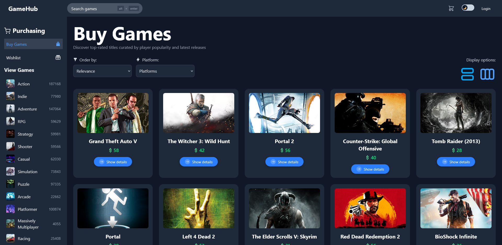

# Game Hub - Information Technology Institue (ITI)

This is a gaming platform built using Angular, TypeScript, and Tailwind CSS. It allows users to discover, browse, and purchase games while providing detailed information about each title.

## Table of contents

- [Overview](#overview)
  - [The challenge](#the-challenge)
  - [Screenshot](#screenshot)
  - [Links](#links)
- [Our process](#our-process)
  - [Built with](#built-with)
- [Authors](#authors)

## Overview

### The challenge

Users should be able to:

- View and browse games with responsive layout across all devices
- Filter games by genre, platform, and other criteria
- Sort games by different parameters (name, release date, popularity, etc.)
- Toggle between different layout views for game listings
- Add/Remove games from their wishlist
- View detailed information about each game
- Complete the purchase process for selected games
- Access their wishlist of saved games
- Receive form validations during registration and login
- Maintain session state across browser refreshes
- View order history and manage their profile
- Admin users can access dashboard for management tasks

### Screenshot

### Links

- Web Application Solution URL: (https://github.com/YoussefSallem/game-hub-frontend/)
- Backend Solution URL: (https://github.com/AhmedShebl2000/game-hub-backend/)
- Live Site URL: (https://game-hub-iti.netlify.app/home/)
- Live Back-end URL: (https://game-hub-backend-woad.vercel.app/api/)

## Our process

### Built with

- [Angular](https://angular.io/) - Web Framework
- [TypeScript](https://www.typescriptlang.org/) - Programming Language
- [Tailwind CSS](https://tailwindcss.com/) - CSS Framework
- [Node.js](https://nodejs.org/) - Runtime Environment
- [Express](https://expressjs.com/) - Backend Framework
- [MongoDB](https://www.mongodb.com/) - Database
- RESTful API Architecture
- Responsive Design principles
- JWT Authentication
- Lazy Loading
- Component-Based Architecture

## Authors

<table>
  <tr>
    <td align="center">
      <a href="https://github.com/Youssef-Yasser-Mahmoud">
         
        <b>Youssef Yasser</b> </a
      > 
      <a href="https://www.linkedin.com/in/youssef-yasser-mahmoud/">LinkedIn</a>
    </td>
    <td align="center">
      <a href="https://github.com/KareemEhab">
         
        <b>Kareem Ehab</b> </a
      > 
      <a href="https://www.linkedin.com/in/kareem-hamouda/">LinkedIn</a>
    </td>
    <td align="center">
      <a href="https://github.com/mahmoud1mandour">
         
        <b>Mahmoud Mohamed</b> </a
      > 
      <a href="https://www.linkedin.com/in/mahmoud1mandour/">LinkedIn</a>
    </td>
    <td align="center">
      <a href="https://github.com/AhmedShebl2000">
         
        <b>Ahmed Shebl</b> </a
      > 
      <a href="https://www.linkedin.com/in/ahmedshebl16/">LinkedIn</a>
    </td>
    <td align="center">
      <a href="https://github.com/YoussefSallem">
         
        <b>Youssef Salem</b> </a
      > 
      <a href="https://www.linkedin.com/in/yousseffsalem/">LinkedIn</a>
    </td>
  </tr>
</table>
